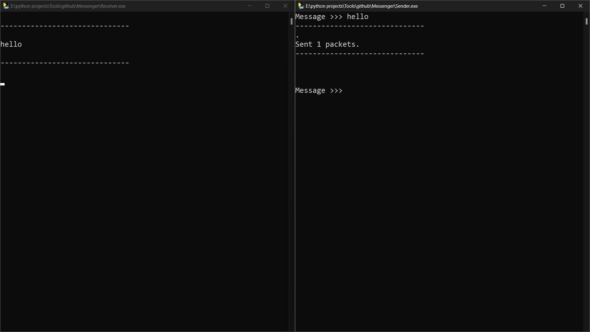

# [Messenger](https://github.com/Sina2468/Messenger) . [](./LICENSE)  

Sending and receiving messages into your LAN



## Installation

1. Clone the project

```
git clone https://github.com/Sina2468/Messenger.git
```

2. Or download it 

```
https://github.com/Sina2468/Messenger/archive/refs/heads/main.zip
```

## Usage

1. Run **Messenger.exe**

2. type your friend's **IP** and prees **Enter**

* in one window you can type your message
* and in another window you can see messages


## License

[MIT licensed](./LICENSE)
